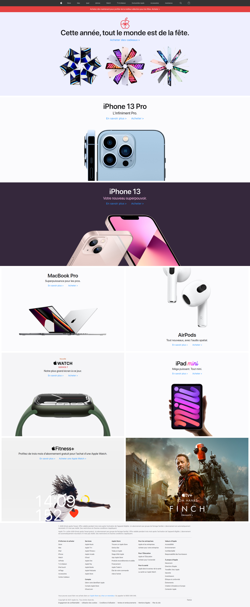
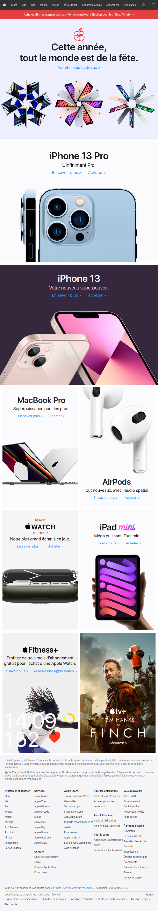
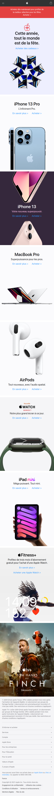

# Apple home page integration

Apple home page integration for educational purpose (Chrismas time end 2021)

## Requirements
This project use the task runner [Gulp](https://gulpjs.com/) so you need to install [Nodejs](https://nodejs.dev/) in order to launch the watcher or to make a build for production

## Used technologies
- Sass
- Bem convention
- Javascript
- Gulp task runner
- Eslint Airbnb

## Getting started

### Launch the project in watch mode
```
gulp dev
```

### Production build
```
gulp build
```

## Screenshot result
### Desktop screen


### Tablet screen


### Mobile screen

